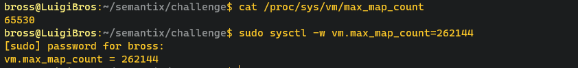
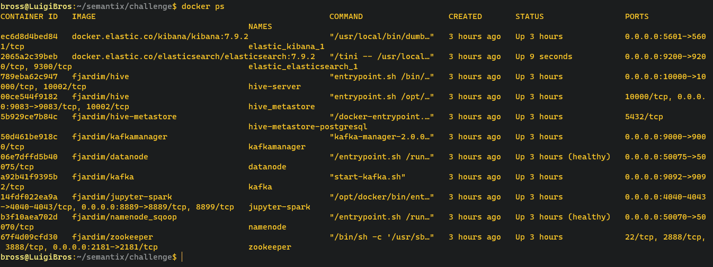

## Campanha Nacional de Vacinação contra Covid-19.

### Desafio Engenharia de Dados da Semantix Academy Módulo 01 - Básico.

# Sobre o Projeto
O Projeto é uma aplicação prática de todo o contéudo ministrado durante o treinamento de **Engenharia de dados** oferecido gratuitamente pela [Semantix Academy](https://www.semantix.ai/semantix-academy).


O Projeto consiste em uma exploração dos dados da Covid_19 que podem ser encontrados no site do [opendatasus](https://opendatasus.saude.gov.br/dataset/covid-19-vacinacao). Podendo ser fácilmente adaptado para outras finalidades dependendo apenas da base de dados e alterando algumas linhas de código.

O Projeto segue uma ordem lógica e para isso vou detalhar cada etapa a seguir, começando com a preparação do ambiente **wsl2 + docker**. 

Utilizaremos o Subsistema do Windows para Linux **wsl2**.
[documentação wsl2](https://docs.microsoft.com/pt-br/windows/wsl/install) onde você encontrará o passo a passo para poder instalar e configurar o wsl2.

Faremos uso de *containers docker* - [instalar docker desktop ](https://www.docker.com/get-started/) para facilitar a comunicação das tecnologias necessárias para o dsenvolvimento do projeto Utilizaremos o *docker-compose.yml*.

No Projeto temos dois arquivos **docker-compose**, um sendo do ambiente Spark e outro do ambiente Elastic.

Iniciando o primeiro **docker-compose-parcial.yml** que contém o ambiente **Spark e kafka**, Para isso iremos digitar o comando a seguir. 

```
docker-compose -f docker-compose-parcial.yml up -d
```

Antes de inciarmos o  **docker-compose** dentro do **diretório elastic** precisamos setar o **vm.max_map_count** para o valor mínimo de **262144**. Consulte a versão de sua distribuição para setar o valor. No meu caso estou usando o **Ubuntu 20.04.4 LTS** então o comando será.

<p align='center'>
  
</p>

Agora acessando o diretório **/elastic** iremos inicializar o outro **docker-compose.yml**.

```
docker-compose up -d
```

depois de finalizado podemos ver todos os containers ativos.

<p align='center'>
  
</p>

Como temos dois arquivos **docker-compose** iremos fazer uso de **extra_hosts** para comunicação dos containers. Para saber mais sobre o assunto leia a documentação a seguir: [Compose file - extra_hosts](https://docs.docker.com/compose/compose-file/compose-file-v2/).

Com tudo devidamente configurado iremos dar ínicio aos estudos.

- Enviar os dados para o hdfs.
- Otimizar todos os dados do hdfs para uma tabela Hive particionada por município.
- Criar as 3 vizualizações pelo Spark com os dados enviados para o HDFS.
- Salvar a primeira visualização como tabela Hive.
- Salvar a segunda visualização com formato parquet e compressão snappy.
- Salvar a terceira visualização em um tópico no Kafka.
- Criar a visualização pelo Spark com os dados enviados para o HDFS.
- Salvar a visualização do exercício 6 em um tópico no Elastic.
- Criar um dashboard no Elastic para visualização dos novos dados enviados.


